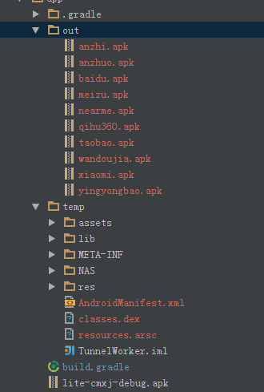

## android-gradle-mulchannel-plugin

Gradle plugin for multiple channel apks

## Contents
 * [Overview](#over_view )
 * [Supported features](#support_features)
 * [Use plugin](#use_plugin)
       * [In Remote(Not need clone thie project to use)](#in_remote)
       * [In Local(Need clone this project to use)](#in_local)
 * [License](#license)

## Overview

This plugin generates multiple apks from different channel.
Generation has to be invoked as additions gradle task.

## <a id="support_features"/>Supported features

 * inputFile-config input file
 * tempDir-config unzip dir
 * outputDir-config output dir
 * channels-config multiple channels

## <a id="use_plugin"/>Use plugin
### <a id="in_remote"/>In Remote(Not need clone thie project to use)
1.Add dependency to the __top-level__ `build.gradle` file.
    
    buildscript {
        repositories {
            jcenter()
        }
        dependencies {
            classpath ' classpath 'me.zhangls:android-mulchannel-plugin:0.0.1''
        }
    }
2.Apply plugin and add configuration to `build.gradle` of the application, eg:

    apply plugin: 'mulchannel'
    
3.Config mulchannel extension(inputFile,tempDir,outputDir,channels),eg:

    mulchannel {
        inputFile = file('lite-cmxj-debug.apk')
        tempDir = file('temp')
        outputDir = file('out')
        channels = ["qihu360","baidu","yingyongbao","wandoujia","taobao","xiaomi","nearme","anzhuo","anzhi","meizu"]
    }

4.Use `gradle mulchannel` to make multiple channel apks
### <a id="in_local"/>In Local(Need clone this project to use)

1.Use `gradle install` command,To install the plug in local maven

2.Add dependency to the __top-level__ `build.gradle` file.
    
    buildscript {
        repositories {
            mavenLocal()
        }
        dependencies {
            classpath 'me.zhangls:mulchannel:0.0.1'
        }
    }

3.Apply plugin and add configuration to `build.gradle` of the application, eg:

    apply plugin: 'mulchannel'

4.Config mulchannel extension(inputFile,tempDir,outputDir,channels),eg:

    mulchannel {
        inputFile = file('lite-cmxj-debug.apk')
        tempDir = file('temp')
        outputDir = file('out')
        channels = ["qihu360","baidu","yingyongbao","wandoujia","taobao","xiaomi","nearme","anzhuo","anzhi","meizu"]
    }

5.Use `gradle mulchannel` to make multiple channel apks

## <a id="license">License

MIT License
See [LICENSE](https://github.com/ihrthk/android-gradle-mulchannel-plugin/blob/master/LICENSE) file.
